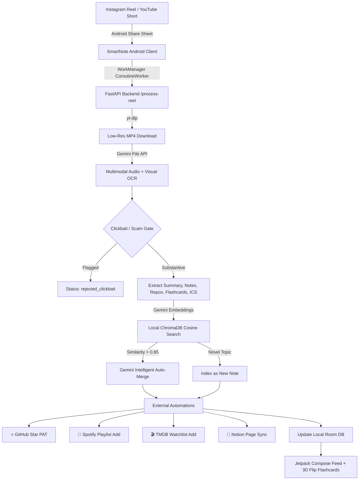

# SmartNote: Autonomous Social Video Knowledge Pipeline & Android Client

[](https://github.com/vedantexists/smartnoteapp/actions/workflows/build-apk.yml)
[](https://fastapi.tiangolo.com)
[](https://ai.google.dev)
[](https://www.trychroma.com)
[](https://developer.android.com/jetpack/compose)

An end-to-end, 100% free-tier optimized pipeline consisting of a **Jetpack Compose Android client** (compatible with all modern Android devices, Android 7.0+ / API 24+) and a **Python FastAPI backend** containerized for Hugging Face Spaces. It ingests social video URLs (Instagram Reels, YouTube Shorts), extracts structured knowledge via the **Google Gemini Multimodal File API**, semantically deduplicates notes with **local ChromaDB**, and automates multi-service actions across **GitHub, Spotify, TMDB, and Notion**.

---

## 🏛️ System Architecture



---

## 📱 1. Android Client (`app/`)
- **Universal Android Compatibility & Battery Resilience:** Supports Android 7.0+ (API 24 to 34+), covering over 97% of all active Android devices (Samsung, Google Pixel, Xiaomi, OnePlus, Motorola, Nothing, etc.). SmartNote utilizes **AndroidX WorkManager** with `NetworkType.CONNECTED` and exponential backoff, ensuring deferred background sync survives aggressive OEM battery management and process suspension.
- **System Share Receiver:** Configured with `ACTION_SEND` intent filter for `text/plain` to seamlessly intercept links shared directly from Instagram or YouTube.
- **Local Persistence (Room DB):** `NoteEntity`, `LinkItemEntity`, `MediaRecEntity`, and `FlashcardEntity` with transactional updates.
- **Interactive Jetpack Compose UI:**
  - **Notes Feed:** Rich card view with integration badges (⭐ GitHub Starred, 🎵 Spotify Added, 🎬 TMDB Added, 📝 Notion Synced).
  - **Semantic Search:** Conceptual querying against the backend vector space.
  - **Active Recall Flashcards:** Interactive 3D flip card with rotation animation (`rotationY`) for spaced repetition review.
  - **Native Calendar Sync:** One-tap calendar event importing (`.ics` via `ACTION_VIEW` and `FileProvider`).
  - **Sunday Digest:** Automated weekly knowledge synthesis overview.

---

## 🐍 2. Backend (`backend/`)
- **Containerized for Hugging Face Spaces:** Exposes port `7860`, non-root user `user` (UID 1000), local storage persisted under `/data`.
- **Multimodal Video Processing:** Downloads lightweight 480p/720p `.mp4` using `yt-dlp`, uploads to Gemini File API (`ACTIVE` polling), extracts deep structured JSON, and deletes the file from Google servers.
- **Clickbait & Fact-Check Gate:** Halts and rejects scams or deceptive dropshipping promotions (`status: rejected_clickbait`).
- **Semantic Deduplication:** ChromaDB cosine distance evaluation (> 0.85 threshold). Automatically merges duplicate notes using Gemini synthesis.
- **Automations:**
  - GitHub: Strict `PUT https://api.github.com/user/starred/{owner}/{repo}` with PAT.
  - Spotify: Search tracks and append to target playlist via `spotipy`.
  - TMDB: Search movies/TV series and append to watchlist.
  - Notion: Create page blocks with structured notes, callouts, and bookmarks.
- **Scheduled Weekly Digests:** `APScheduler` cron job running every Sunday at 00:00 UTC.

---

## ⚙️ 3. CI/CD Pipeline (`.github/workflows/build-apk.yml`)
- Triggers on `push` to `main` and `workflow_dispatch`.
- Sets up JDK 17 (Temurin) and Android SDK.
- Runs `./gradlew assembleDebug --stacktrace`.
- Publishes the compiled APK as a downloadable workflow artifact (`app-debug`).

---

## 🚀 Quick Start

### Backend Deployment (Hugging Face Spaces)
1. Create a new Docker Space on Hugging Face Spaces.
2. Push the contents of `backend/` or connect this repository.
3. Configure repository secrets from `backend/.env.example` (`GEMINI_API_KEY`, `GITHUB_PAT`, `NOTION_API_KEY`, etc.).

### Local Backend Run
```bash
cd backend
pip install -r requirements.txt
cp .env.example .env
uvicorn app.main:app --host 0.0.0.0 --port 7860 --reload
```

### Android Build
```bash
./gradlew assembleDebug
```
The resulting APK will be generated at `app/build/outputs/apk/debug/app-debug.apk`.
